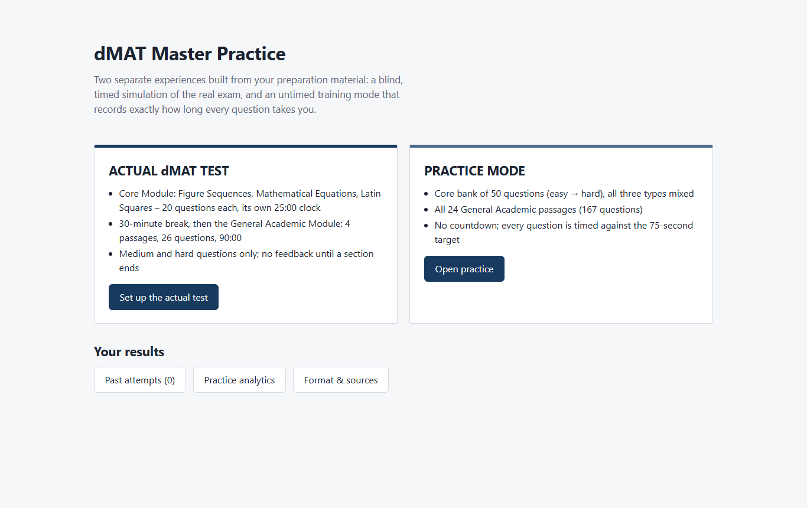
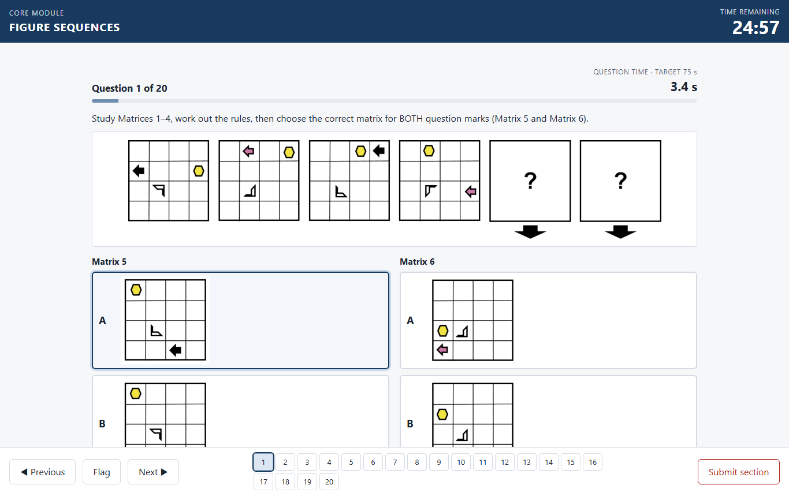
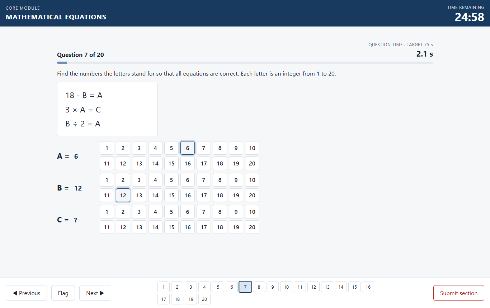
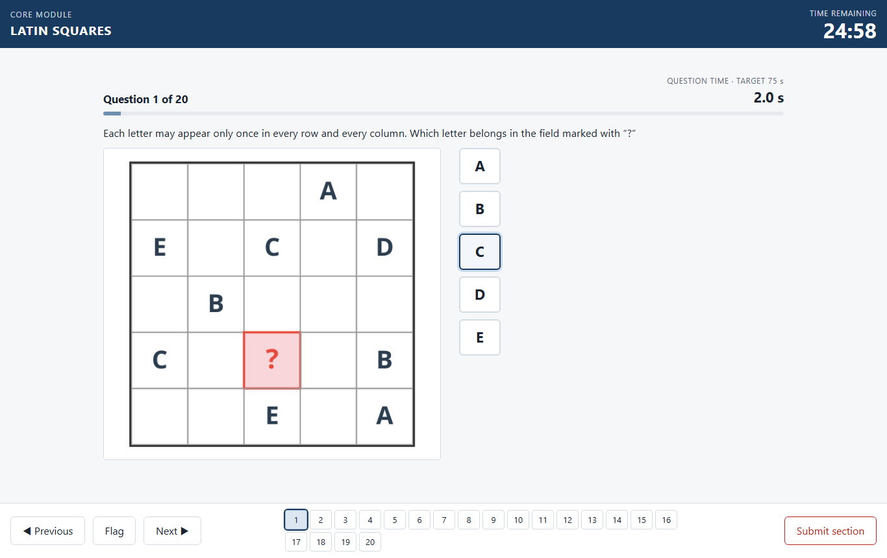
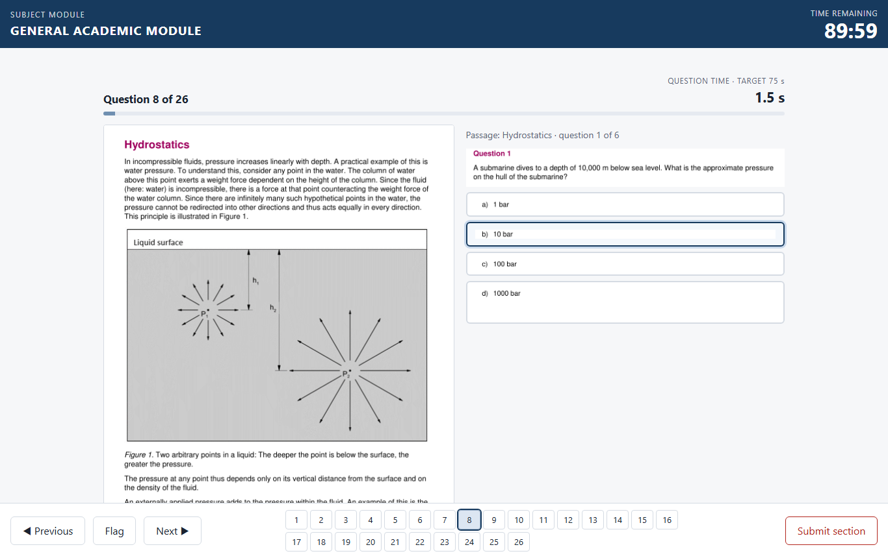
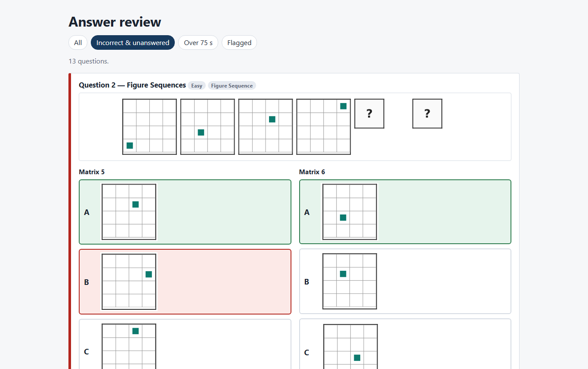
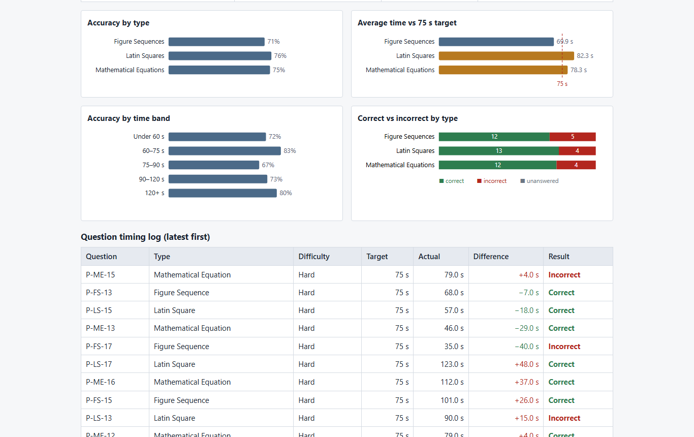
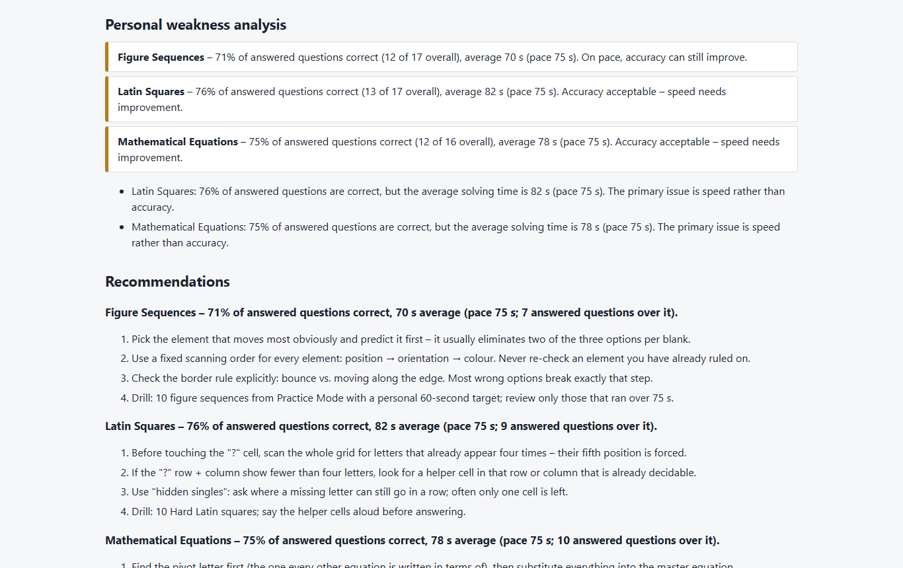

<div align="center">

# dMAT Master Practice

**A self-contained, offline exam simulator and training app for the dMAT (Digitaler Mastertest)**

Two separate experiences: a blind, timed **Actual dMAT Test** and an untimed **Practice Mode** that records exactly how long every question takes you.




</div>

---

## Quick start (no technical knowledge needed)

1. **[⬇ Download dMAT-Master-Practice.zip](https://github.com/krishna-ITTL/Dmat/raw/main/download/dMAT-Master-Practice.zip)** (about 4.5 MB).
2. Unzip it: on Windows, right-click → **Extract All…**; on a Mac, double-click it.
3. Open the extracted folder and double-click **`dmat_master_practice.html`**. It opens in Chrome or Edge, with nothing to install and no internet needed.

📘 **Step-by-step guide with pictures and troubleshooting: [INSTALL.md](INSTALL.md)**

Your results are stored in your browser, so always use the same browser and the same folder to keep your practice history.

---

## What's inside

### Actual dMAT Test: the exam experience

| Part | Questions | Time | Notes |
|---|---|---|---|
| Figure Sequences | 20 | **25:00** own clock | choose Matrix 5 **and** Matrix 6 |
| Mathematical Equations | 20 | **25:00** own clock | pick a value 1–20 for every letter |
| Latin Squares | 20 | **25:00** own clock | 5 × 5 grid, letters A–E |
| Break | — | 30:00 (skippable) | |
| General Academic Module | 26 (4 passages) | **90:00** | figures, tables and formulas from the official material |

- Medium and hard questions only. Difficulty is stored for analytics and never shown during the test.
- The test is blind: answers are saved but never marked until the section ends.
- Unused time never carries over. The section auto-submits at 0:00 and cannot be submitted twice.
- A 75-second question timer and pacing bar sit under every question. It is **a pacing target, never a cut-off**.

<p align="center">
  
</p>

<table>
<tr>
<td width="50%"></td>
<td width="50%"></td>
</tr>
<tr>
<td align="center"><b>Mathematical Equations</b>: a 1–20 picker for every letter</td>
<td align="center"><b>Latin Squares</b>: original grid with A–E options</td>
</tr>
</table>

<p align="center">
  
  <br><b>General Academic Module</b>: passage and figures on the left, the question on the right
</p>

### Practice Mode: training with exact timing

- **Core bank of 50 questions** mixing Figure Sequences, Latin Squares and Mathematical Equations, from easy to hard.
- **All 24 General Academic passages** (167 questions), untimed, with the time for each question recorded.
- Filter by type, difficulty, *not attempted yet* or *previously wrong*.
- Tag how you approached each passage (question-first, passage-first or skim-then-question). The app compares these strategies once you have enough data.

### Full answer review after every section

Every question with its original image, all options, **your answer (red if wrong)**, **the correct answer (green)**, time used, your status against the 75-second target, a step-by-step explanation and the source page.

<p align="center"></p>

### Analytics, weak spots and recommendations

- Accuracy, average and median time, fastest and slowest question, and questions over or under 75 s for each section.
- Practice: an **accuracy matrix by type and difficulty**, **time-efficiency bands** (<60, 60–75, 75–90, 90–120, 120+ s), a timing log with the difference from target, and repeated mistakes.
- A weakness analysis and recommendations computed **only from your recorded data**, e.g. *"Latin Squares: 76% of answered questions correct, but 82 s average – the primary issue is speed."*

<table>
<tr>
<td width="50%"></td>
<td width="50%"></td>
</tr>
</table>

---

## Official rules vs. custom settings

Rules come from **dMAT – General Academic Module, Preparatory Materials for Test Takers** (g.a.s.t., as at 02.09.2026).

| Official (g.a.s.t.) | Custom practice setting |
|---|---|
| Core: 3 subtests, each 20 tasks in 25 min | 75-second question target (25 min ÷ 20), display only |
| Figure Sequences: choose the next two matrices; figures never overlap or leave the grid | Scoring: correct only if both matrices are right |
| Equations: every letter is an integer 1–20, one solution | Input: choose the value of each letter |
| Latin Squares: 5 × 5, letters A–E | — |
| Subject / General Academic Module: 90 min, 4 options per question; **number of questions not specified** | 4 passages × 6–7 questions (26) |
| 30-minute break between the modules; no notes allowed | Break can be skipped |

---

## How the questions were checked

Every source answer key was **machine-verified**. Anything that failed was left out.

| Type | Check | Kept | Rejected |
|---|---|---|---|
| Mathematical Equations | Solved exactly (fraction arithmetic); the system must have exactly one solution with all letters 1–20, matching the key | 188 | 16 |
| Latin Squares | Grid read from the PDF, then a complete search confirms the "?" has exactly one possible letter; explanations come from a step-by-step deduction | 148 | 42 |
| Figure Sequences | Shapes read from the figures; movement and rotation rules fitted to Matrices 1–4 must predict exactly one option per blank and match the key | 107 | 74 |

Figures and grids are **cropped from the source PDFs, not redrawn**, and embedded in the HTML as images.

---

## Repository layout

```
dmat_master_practice.html   ← the app (open this)
download/                   ← dMAT-Master-Practice.zip (app + "HOW TO START" guide)
                              PREP-study-materials.zip (all source PDFs)
README.md, INSTALL.md
docs/images/                ← screenshots used in this README
_build/                     ← pipeline that builds the app from the PDFs
  common.py                   source file paths
  me.py                       equation parser, exact solver and explanation writer
  ls.py                       Latin-square grid reader, solver and deduction path
  fs.py                       figure-sequence reader and rule fitting (vector + raster)
  ga.py, ga_expl.py           General Academic practice passages and explanations
  official.py                 official material: crops, keys, explanations
  assemble.py                 selects questions into separate Actual / Practice pools and embeds crops
  app.html                    app template (HTML, CSS and vanilla JS)
  build.py                    inlines the question bank into the single HTML file
  test_app.js                 990 headless checks (timer engine, scoring, blind test, data integrity)
```

### Rebuild

The source PDFs are in **[`download/PREP-study-materials.zip`](download/PREP-study-materials.zip)** (private repository, copyrighted material, for personal study only). Extract it and copy its `Academic Module/` and `CORE MODULE/` folders next to `_build/`; the expected file names are listed in [`_build/common.py`](_build/common.py).

Requires Python 3 with [PyMuPDF](https://pymupdf.readthedocs.io/) and Node.js.

```bash
pip install pymupdf
python _build/assemble.py     # verify sources, select questions, crop images -> _build/bank.json
python _build/build.py        # inline the bank -> dmat_master_practice.html
node _build/test_app.js       # run all checks
```

---

## Disclaimer

This is an unofficial, personal study tool. It is not affiliated with or endorsed by g.a.s.t., TestDaF-Institut or DAAD. **dMAT** and all official preparation material are © g.a.s.t., Bochum. Other preparation materials belong to their respective authors. This repository is private and the materials are kept here for personal study only – do not redistribute them. If you own content in this repository and want it removed, please open an issue.
